# Distributed Hadoop Analytics Pipeline — Execution Flow

## Table of Contents

- [Overview](#overview)
- [System Architecture](#system-architecture)
- [Execution Flow](#execution-flow)
- [Component Interactions](#component-interactions)
- [Data Flow](#data-flow)
- [Validation & Benchmarking](#validation--benchmarking)
- [فارسی - جریان اجرای پایپ‌لاین تجزیه‌و‌تحلیل توزیع‌شدهٔ Hadoop](#فارسی---جریان-اجرای-پایپ‌لاین-تجزیه‌و‌تحلیل-توزیع‌شدهٔ-hadoop)

---

## Overview

This document provides a comprehensive, step-by-step explanation of the **Distributed Hadoop Analytics Pipeline**. The project implements a distributed data processing system using:

- **Hadoop 2.7.4** for distributed computing
- **.NET (C#)** for MapReduce components and orchestration
- **SQL Server + Dapper** for validation
- **Apache Hive** for comparative SQL analytics
- **Docker Compose** for infrastructure abstraction

The pipeline processes large datasets through multiple processing stages, validates results, and benchmarks performance across different node configurations.

---

## System Architecture

### High-Level Infrastructure

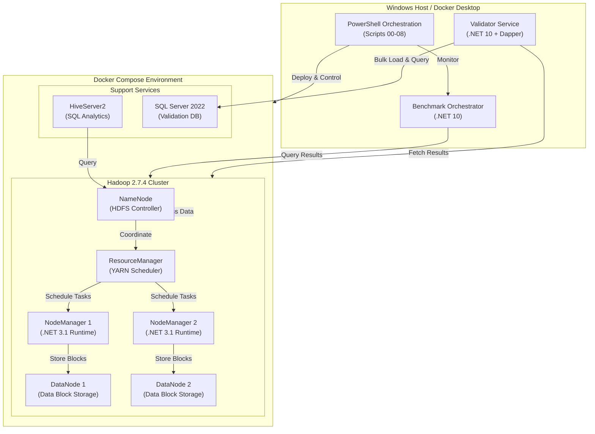

### Component Roles

| Component | Role | Technology | Version |
|-----------|------|-----------|---------|
| **Mapper** | Transforms input records into key-value pairs | .NET Core | 3.1 |
| **Reducer** | Aggregates values for each key | .NET Core | 3.1 |
| **Validator** | Verifies results using SQL Server | .NET / Dapper | 10 |
| **Benchmark** | Measures performance across configurations | .NET | 10 |
| **DataGen** | Generates synthetic test datasets | .NET | 10 |
| **HDFS** | Distributed file storage | Hadoop | 2.7.4 |
| **YARN** | Resource scheduling | Hadoop | 2.7.4 |
| **Hive** | SQL query execution | Apache Hive | 2.3.2 |
| **SQL Server** | Validation database | Microsoft SQL Server | 2022 |

---

## Execution Flow

### Complete Pipeline Workflow

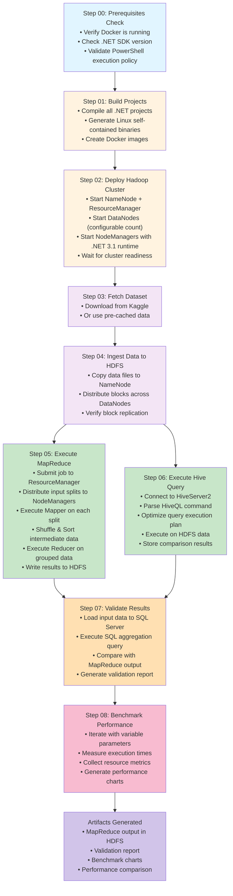

### MapReduce Job Execution Detail

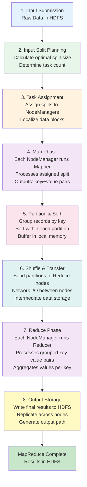

---

## Component Interactions

### Data Processing Pipeline Sequence

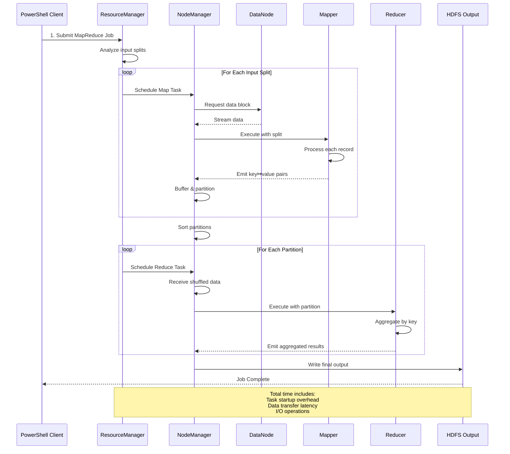

### Validation Workflow

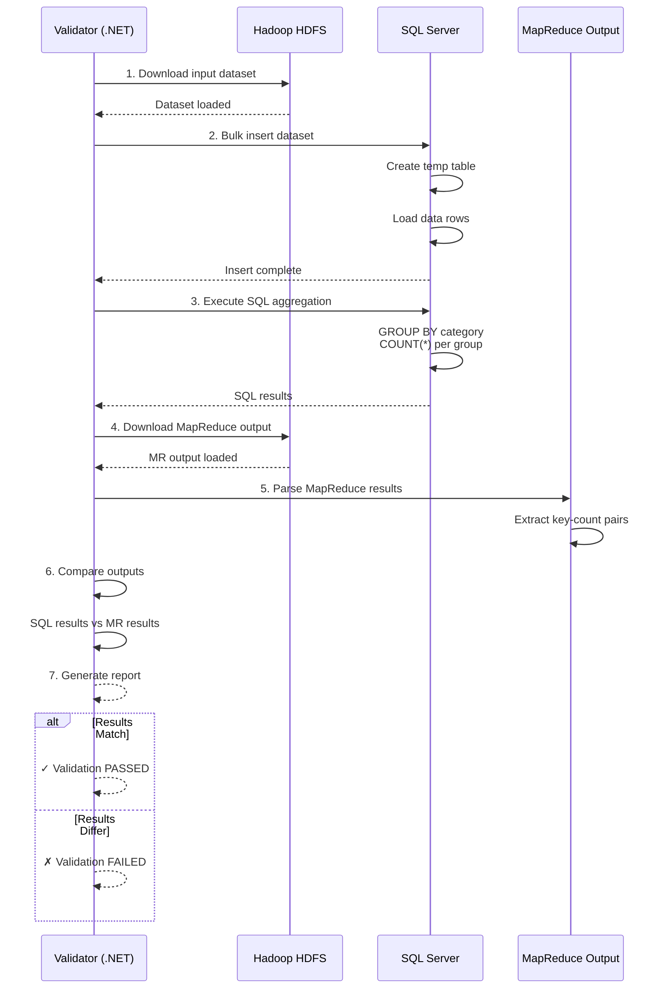

---

## Data Flow

### End-to-End Data Journey

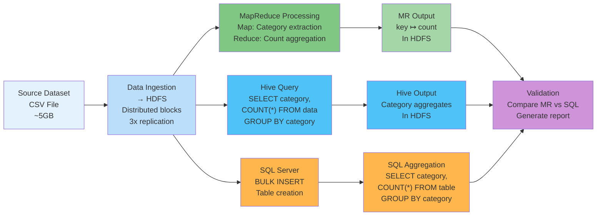

---

## Validation & Benchmarking

### Validation Comparison Matrix

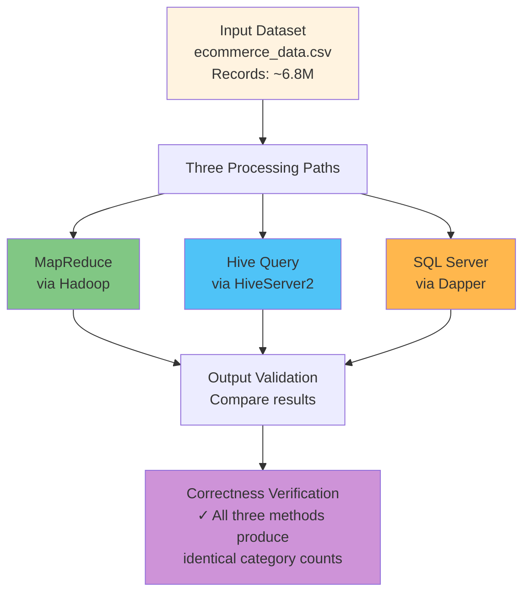

### Performance Benchmark Metrics

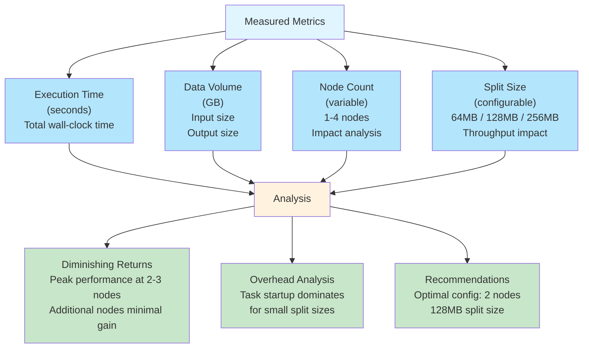

---

# فارسی — جریان اجرای پایپ‌لاین تجزیه‌و‌تحلیل توزیع‌شدهٔ Hadoop

## خلاصه کلی

این سند توضیح جامع و مرحله‌به‌مرحله **جریان اجرای پایپ‌لاین تجزیه‌و‌تحلیل توزیع‌شده** را ارائه می‌دهد. این پروژه سیستم پردازش داده توزیع‌شده را پیاده‌سازی می‌کند و از:

- **Hadoop 2.7.4** برای محاسبات توزیع‌شده
- **.NET (C#)** برای اجزای MapReduce و هماهنگی
- **SQL Server + Dapper** برای اعتبارسنجی
- **Apache Hive** برای تجزیه‌و‌تحلیل SQL مقایسه‌ای
- **Docker Compose** برای انتزاع زیرساخت

استفاده می‌کند.

---

## معماری سیستم (فارسی)

### زیرساخت سطح بالا

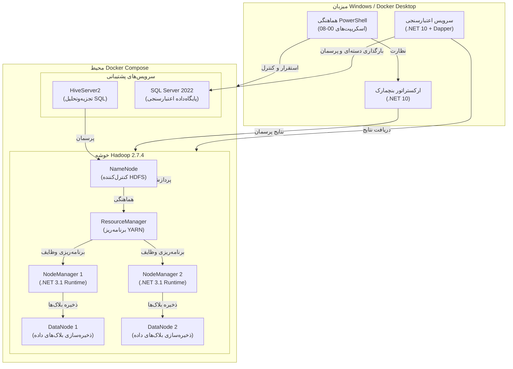

---

## جریان اجرا (فارسی)

### جریان کاری کامل پایپ‌لاین

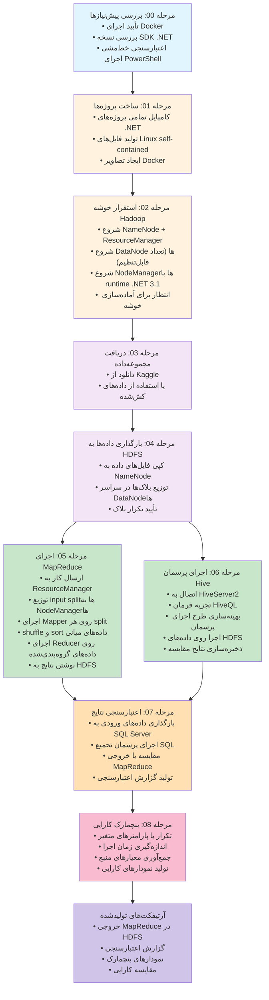

---

## جریان اعتبارسنجی (فارسی)

### ماتریس مقایسه اعتبارسنجی

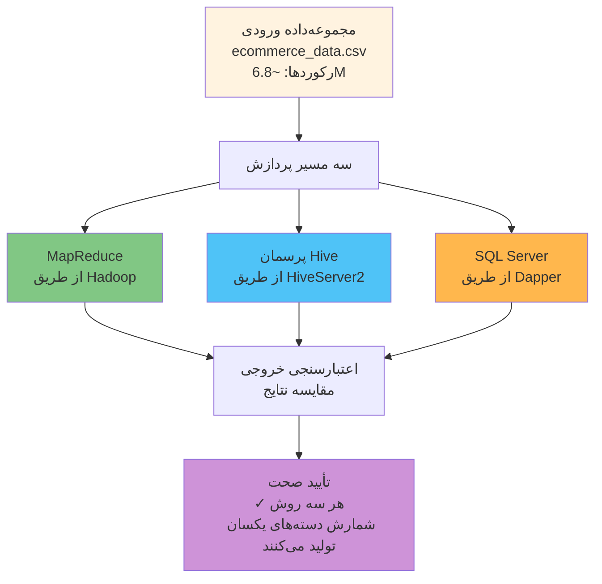

---

**نسخه:** 1.0  
**تاریخ آخرین به‌روزرسانی:** 2026-06-25  
**نویسنده:** Technical Documentation Team
