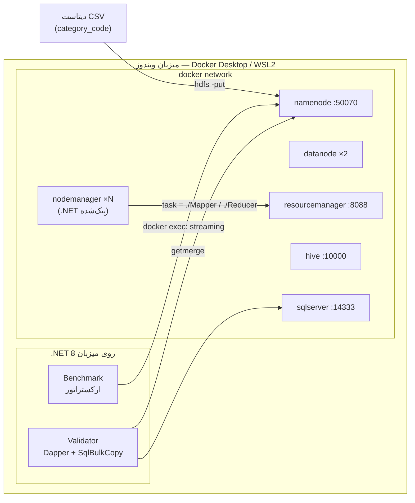

# تحلیل توزیع‌شده روی Hadoop با استکِ .NET + Dapper

پیاده‌سازیِ کاملِ پروژهٔ «تحلیل توزیع‌شده روی Hadoop» با **Docker Compose** (کلاستر Hadoop 2.7.4، Web UI روی پورت **50070**)، که در آن منطقِ **MapReduce** به‌جای Java/Python با **.NET (C#)** و از طریقِ **Hadoop Streaming** نوشته شده، صحت‌سنجی با **SQL Server + Dapper** انجام می‌شود، و عملکرد با تغییرِ تعدادِ گره‌ها (۱/۵/۱۰) و اندازهٔ Split سنجیده می‌گردد.

> 📄 گزارشِ فنیِ کاملِ گام‌به‌گام (با نمودارهای Mermaid و تحلیل): [docs/REPORT.md](docs/REPORT.md)

---

## معماری در یک نگاه



## اجزای .NET

| پروژه | TFM | نقش |
|---|---|---|
| `Common` | netstandard2.0 | `CategoryParser` مشترک (نرمال‌سازیِ یکسانِ دسته در Mapper و Validator) |
| `Mapper` | **netcoreapp3.1** (self-contained linux-x64) | فاز Map: `stdin → category\t1` |
| `Reducer` | **netcoreapp3.1** (self-contained linux-x64) | فاز Reduce/Combine: جمعِ شمارش per-key |
| `Validator` | net10.0 | مبنای تک‌رشته‌ای: `SqlBulkCopy` + `Dapper GROUP BY` + مقایسهٔ صحت |
| `Benchmark` | net10.0 | اجرای ماتریسِ بنچمارک، اندازه‌گیریِ Wall-clock، تولیدِ نمودار |
| `DataGen` | net10.0 | تولیدِ دادهٔ مصنوعیِ هم‌شکل با دیتاست (برای تست/مقیاس) |

> **نسخه‌های .NET:** ابزارهای میزبان روی **.NET 10** (آخرین نسخه) هستند. اما Mapper/Reducer که *داخلِ کانتینرِ NodeManager* اجرا می‌شوند باید **netcoreapp3.1** بمانند: ایمیجِ NodeManager بر پایهٔ **Debian 8 (glibc 2.19)** است؛ .NET 6/7/8/9/**10** به glibc جدیدتر (۲٫۳۵+) نیاز دارند و روی این ایمیج اجرا **نمی‌شوند**، اما .NET Core 3.1 (کفِ glibc 2.17) به‌درستی اجرا می‌شود. این یک محدودیتِ سخت است (تنها ایمیجِ استانداردِ Hadoop با پورت 50070، نسخهٔ ۲٫۷٫۴ روی Debian 8 است). جزئیات و راهِ اختیاریِ «.NET 10 داخلِ کانتینر» در گزارش.

## پیش‌نیازها
- **Docker Desktop** (WSL2) روشن — حدود ۲۵ گیگ RAM و ۴۰ گیگ دیسکِ آزاد.
- **.NET 10 SDK** (در `global.json` روی `10.0.300` پین شده؛ همین SDK هم net10.0 و هم netcoreapp3.1 را می‌سازد).
- برای دادهٔ واقعیِ Kaggle: توکنِ Kaggle API (اختیاری — در غیرِ این‌صورت `DataGen` دادهٔ مصنوعی می‌سازد).

## اجرای گام‌به‌گام (PowerShell)

```powershell
./scripts/00-prereqs.ps1                       # بررسیِ پیش‌نیازها
./scripts/01-build.ps1                          # publish باینری‌های .NET + ساختِ ایمیجِ nodemanager
./scripts/02-cluster-up.ps1 -DataNodes 2 -NodeManagers 1   # بالا آوردنِ کلاستر → http://localhost:50070
./scripts/03-fetch-data.ps1                     # دانلودِ Kaggle  (یا: -UseSynthetic -SizeGB 5)
./scripts/04-ingest.ps1 -File big.csv           # hdfs dfs -put + گزارشِ بلاک‌ها
./scripts/05-run-mapreduce.ps1 -InputPath /data/ecommerce/big.csv -Out /out/mr_big   # MapReduceِ .NET
./scripts/06-run-hive.ps1                        # همان کوئری با Hive
./scripts/07-validate.ps1 -File big.csv -MrOut /out/mr_big   # صحت‌سنجی با SQL Server + Dapper
./scripts/08-benchmark.ps1 -InputPath /data/bench/bench.csv  # ماتریسِ ۱/۵/۱۰ گره × Split
```

نتایج: `results/results.csv`، نمودارها: `results/charts.md`، گزارشِ صحت: `results/validation.md`.

## رابط‌های وب (Web UI)
| سرویس | آدرس |
|---|---|
| HDFS NameNode | http://localhost:50070 |
| YARN ResourceManager | http://localhost:8088 |
| MapReduce History | http://localhost:8188 |
| HiveServer2 | http://localhost:10002 |

## پاک‌سازی
```powershell
docker compose -f docker/docker-compose.yml down -v   # حذفِ کانتینرها و volumeها
```

## دادهٔ واقعیِ Kaggle (به‌جای مصنوعی)
دیتاستِ پیشنهادی: `mkechinov/ecommerce-behavior-data-from-multi-category-store` (فایلِ `2019-Oct.csv` ≈ ۵٫۳ گیگ، ستونِ `category_code`).
توکنِ جدیدِ Kaggle را می‌توانید به‌صورت `KAGGLE_API_TOKEN` تنظیم کنید یا در `%USERPROFILE%\.kaggle\access_token` بگذارید. حالتِ قدیمیِ `KAGGLE_USERNAME`/`KAGGLE_KEY` و `%USERPROFILE%\.kaggle\kaggle.json` هم هنوز پشتیبانی می‌شود. بعد `03-fetch-data.ps1` را اجرا کنید و در گام‌های بعد `-File 2019-Oct.csv` را به‌جای `big.csv` بدهید.
