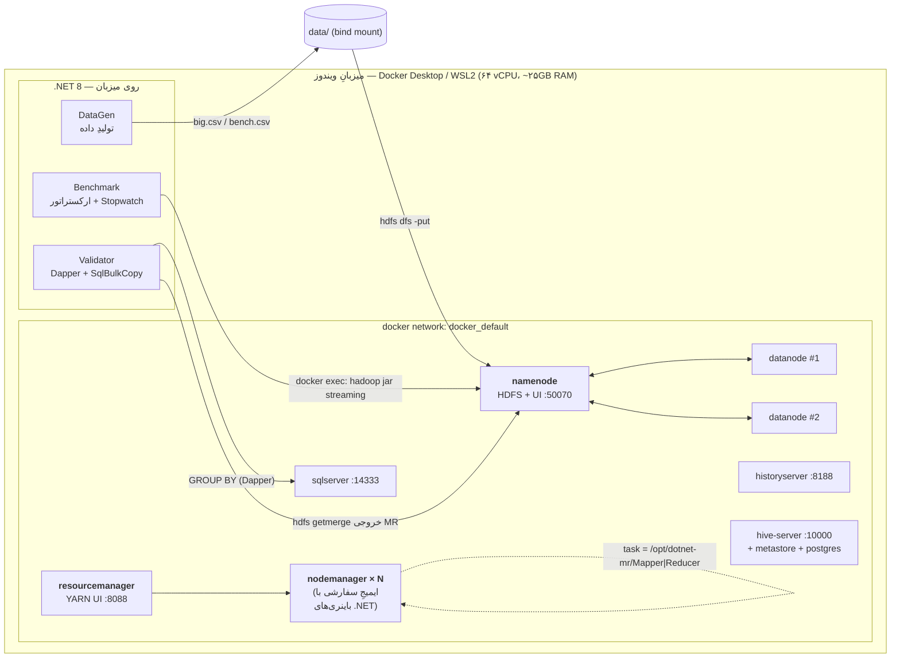
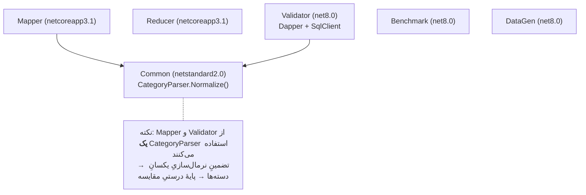
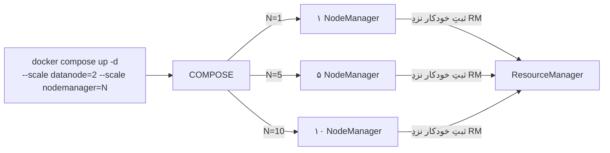
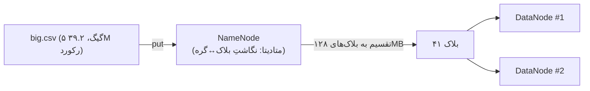
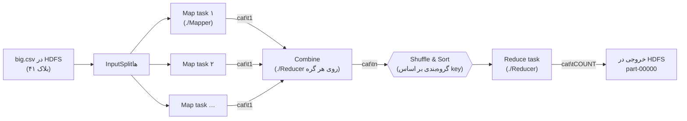
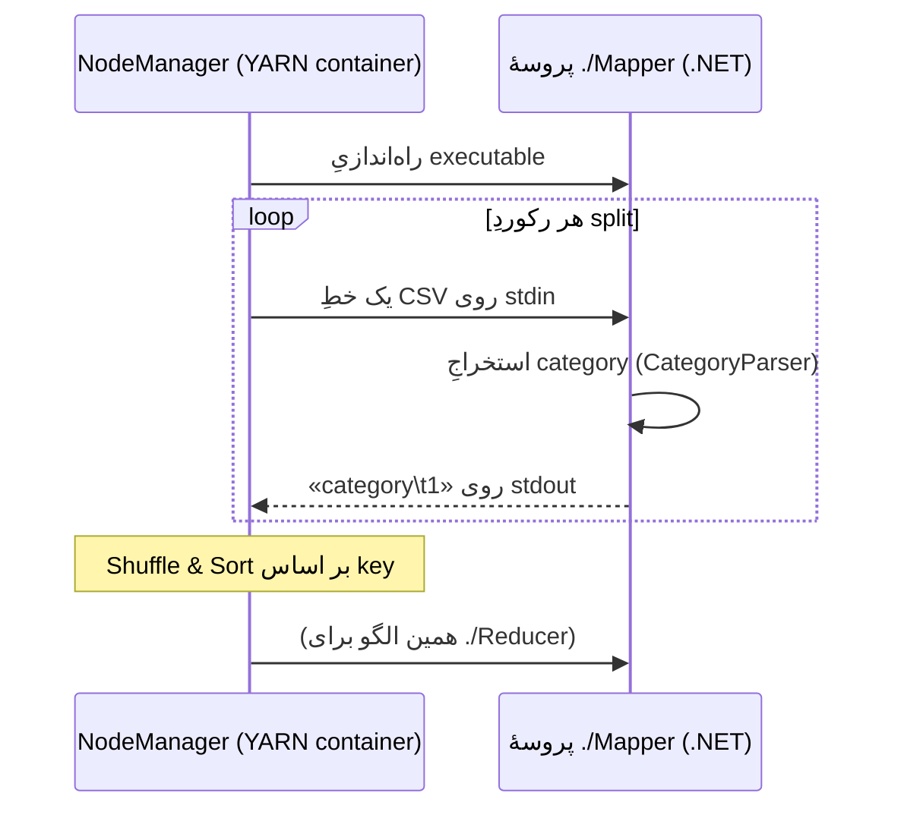
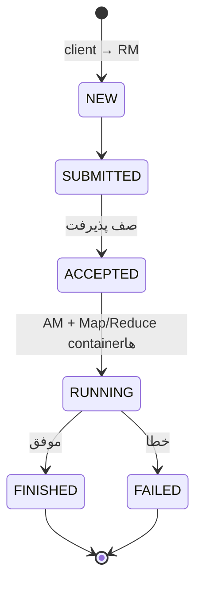
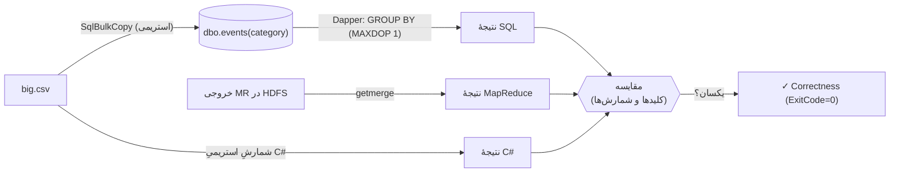
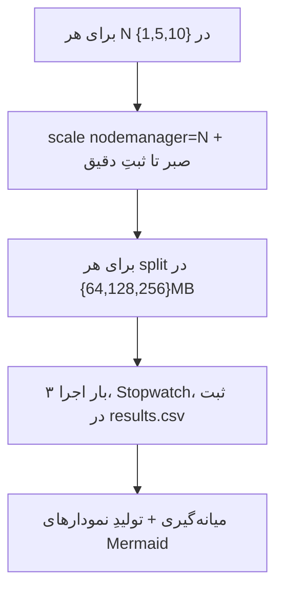

# گزارشِ فنیِ پروژه: تحلیل توزیع‌شده روی Hadoop با استکِ .NET + Dapper

> پروژهٔ عملی شمارهٔ ۱ — درکِ چرخهٔ حیاتِ MapReduce و سنجشِ عملکردِ پردازشِ توزیع‌شده روی دادهٔ حجیم.
> این گزارش «جزء‌به‌جزء» نوشته شده تا بتوان هر مرحله را توضیح داد: چه کردیم، چرا، چطور، و چه دیدیم.

## فهرست
0. [خلاصهٔ اجرایی](#۰-خلاصهٔ-اجرایی)
1. [معماری و تصمیم‌های کلیدی](#۱-معماری-و-تصمیمهای-کلیدی)
2. [زیرساخت (Setup) — کلاستر Docker](#۲-زیرساخت-setup)
3. [Ingestion — ورودِ داده به HDFS](#۳-ingestion)
4. [Processing — MapReduce با .NET و Hive](#۴-processing)
5. [Validation — صحت‌سنجی با SQL Server + Dapper](#۵-validation)
6. [Performance — ارزیابیِ عملکرد](#۶-performance)
7. [جمع‌بندی و بازتولید با دادهٔ واقعیِ Kaggle](#۷-جمعبندی)
8. [پیوست: ساختار، فرمان‌ها، و رفعِ اشکال‌های واقعی](#۸-پیوست)

---

## ۰. خلاصهٔ اجرایی

یک کلاسترِ **Hadoop 2.7.4** سه‌گره‌ای (۱ NameNode + ۲ DataNode + YARN) را با **Docker Compose** بالا آوردیم که Web UI آن روی **پورت 50070** در دسترس است. منطقِ کوئریِ
`SELECT category, COUNT(*) FROM dataset GROUP BY category`
را به سه روشِ مستقل پیاده و نتایج را با هم مقایسه کردیم:

1. **MapReduceِ سفارشی با .NET (C#)** از طریقِ **Hadoop Streaming** — Mapper و Reducer به‌صورتِ executableهای مستقلِ لینوکسی که با `stdin/stdout` کار می‌کنند.
2. **Hive (HiveQL)** — همان کوئری به‌صورتِ SQL که Hive آن را به یک job از MapReduce روی YARN ترجمه می‌کند.
3. **مبنای تک‌رشته‌ای SQL با Dapper** روی **SQL Server** — برای صحت‌سنجی (Correctness).

روی دیتاستِ ۵ گیگابایتی (≈ **۳۹٬۲۴۰٬۴۸۸** رکورد)، **هر سه روش دقیقاً یک نتیجه دادند** (۱۸ دسته، مجموعِ ۳۹٬۲۴۰٬۴۸۸). سپس عملکرد را با تغییرِ **تعدادِ گره (۱/۵/۱۰)** و **اندازهٔ Split (۶۴/۱۲۸/۲۵۶ مگابایت)** سنجیدیم و نشان دادیم چرا روی یک میزبانِ واحد، افزایشِ گره‌ها برای این مقیاسِ داده، کاهشِ زمانِ چشمگیری ایجاد نمی‌کند (سربارِ ارتباطی/زمان‌بندی).

---

## ۱. معماری و تصمیم‌های کلیدی

### ۱.۱ نگاشتِ کلی



### ۱.۲ چرا .NET روی Hadoop؟ — Hadoop Streaming

Hadoop به‌صورتِ بومی Java است، اما ابزارِ **Hadoop Streaming** اجازه می‌دهد *هر* برنامهٔ اجراییی که از `stdin` بخواند و به `stdout` بنویسد، نقشِ Mapper یا Reducer را بازی کند. قرارداد ساده است:

- **Map:** هر خطِ ورودی → خروجیِ «`key<TAB>value`».
- **Shuffle/Sort:** خودِ Hadoop خروجیِ Mapها را بر اساسِ `key` *مرتب* و *گروه‌بندی* می‌کند.
- **Reduce:** خطوطِ مرتب‌شده را می‌خواند و per-key تجمیع می‌کند.

بنابراین کافی است Mapper/Reducer را در C# بنویسیم و به‌صورتِ executableِ لینوکسی منتشر کنیم.

### ۱.۳ تصمیمِ مهم: چرا **.NET Core 3.1** (و نه .NET 8)؟

تسک‌های Map/Reduce *داخلِ کانتینرِ NodeManager* اجرا می‌شوند. با بررسیِ ایمیجِ پایه دیدیم:

```text
PRETTY_NAME="Debian GNU/Linux 8 (jessie)"
ldd (Debian GLIBC 2.19-18+deb8u10) 2.19
```

یعنی glibc نسخهٔ **۲٫۱۹**. کفِ نیازمندیِ نسخه‌های .NET:

| .NET | حداقلِ glibc | روی Debian 8 (2.19)؟ |
|---|---|---|
| .NET Core 3.1 | ~2.17 | ✅ اجرا می‌شود |
| .NET 6 / 7 / 8 / 9 / 10 | 2.23 – 2.38 | ❌ اجرا نمی‌شود |

به همین دلیل Mapper/Reducer را با **netcoreapp3.1** و به‌صورتِ **self-contained linux-x64** (با `InvariantGlobalization=true` تا به libicu نیاز نباشد) منتشر کردیم. تستِ واقعیِ اجرای باینری داخلِ ایمیج موفق بود:

```text
=== map|sort|reduce داخلِ ایمیج ===
(unknown)        1
electronics.smartphone   1
```

ابزارهای *میزبان* (Validator/Benchmark/DataGen) که روی ویندوز اجرا می‌شوند، با **.NET 10** (آخرین نسخه) نوشته شده‌اند و SDK پروژه در `global.json` روی `10.0.300` پین شده است (همین SDK هر دو هدفِ net10.0 و netcoreapp3.1 را می‌سازد). کتابخانهٔ مشترکِ `Common` روی `netstandard2.0` است تا از *هر دو* نسخه (netcoreapp3.1 و net10.0) قابلِ ارجاع باشد.

> اگر در آینده اجرای **.NET 10 داخلِ کانتینر** لازم شد (نه فقط روی میزبان)، باید ایمیجِ NodeManager را روی یک پایهٔ مدرن (مثلاً `mcr.microsoft.com/dotnet/runtime:10.0` + نصبِ Java 8 + کپیِ Hadoop 2.7.4) بازسازی کرد؛ این کار شدنی اما پیچیده است و در این پروژه — به‌خاطرِ سادگی و پایداری — Mapper/Reducer روی netcoreapp3.1 نگه داشته شده‌اند.

### ۱.۴ تصمیمِ مهم: چرا باینری‌ها را در ایمیجِ NodeManager «بِیک» کردیم؟

دو راه برای رساندنِ باینری به گره‌ها وجود دارد: گزینهٔ `-files` (ارسالِ فایل با هر job) یا بِیک‌کردن در ایمیج. ما ایمیجِ سفارشی ساختیم چون:
- بیتِ اجرایی (`chmod +x`) را قطعی می‌کند (هنگامِ COPY از ویندوز، بیتِ اجرایی حفظ نمی‌شود).
- سربارِ ارسالِ ~۷۰ مگابایت باینری در هر job حذف می‌شود.
- مسیرِ ثابتِ `/opt/dotnet-mr/{Mapper,Reducer}` در همهٔ replicaهای NodeManager موجود است.

```dockerfile
FROM bde2020/hadoop-nodemanager:2.0.0-hadoop2.7.4-java8
COPY bin/ /opt/dotnet-mr/
RUN chmod -R a+rX /opt/dotnet-mr && \
    chmod a+rx /opt/dotnet-mr/Mapper/Mapper /opt/dotnet-mr/Reducer/Reducer
```

### ۱.۵ نقشِ Dapper

صورتِ پروژه می‌خواهد خروجی با «یک اسکریپتِ SQL در حالتِ تک‌رشته‌ای» مقایسه شود. ما این مبنا را با **Dapper** (micro-ORM سبکِ .NET) روی **SQL Server** پیاده کردیم: داده با `SqlBulkCopy` بار می‌شود و سپس همان کوئریِ `GROUP BY` به‌صورتِ تک‌رشته‌ای (`OPTION (MAXDOP 1)`) با Dapper اجرا و با خروجیِ MapReduce مقایسه می‌گردد.

### ۱.۶ نمودارِ وابستگیِ پروژه‌های .NET



---

## ۲. زیرساخت (Setup)

### ۲.۱ سرویس‌ها و پورت‌ها

کلاستر بر پایهٔ ایمیج‌های استانداردِ `bde2020` (همان استکِ معروفِ big-data-europe) با تگِ **`...hadoop2.7.4-java8`** است؛ همین نسخه است که Web UI را روی **پورت 50070** ارائه می‌کند (نسخهٔ ۳ پورت 9870 دارد).

| سرویس | ایمیج | پورتِ میزبان | نقش |
|---|---|---|---|
| namenode | hadoop-namenode 2.7.4 | **50070**، 8020 | متادیتای HDFS + UI |
| datanode ×۲ | hadoop-datanode 2.7.4 | — (مقیاس‌پذیر) | ذخیرهٔ بلاک‌ها |
| resourcemanager | hadoop-resourcemanager 2.7.4 | 8088 | زمان‌بندِ YARN |
| nodemanager ×N | **ایمیجِ سفارشی** | — (مقیاس‌پذیر ۱/۵/۱۰) | اجرای تسک‌ها (با .NET) |
| historyserver | hadoop-historyserver 2.7.4 | 8188 | تاریخچهٔ jobها |
| hive-server/metastore/postgres | bde2020/hive 2.3.2 | 10000، 9083 | کوئریِ Hive |
| sqlserver | mssql/server 2022 | 14333 | مبنای Dapper |

### ۲.۲ پروفایلِ حافظهٔ ۱۶ گیگ و مقیاس‌پذیری

پیکربندی با متغیرهای محیطی به XML تبدیل می‌شود (`_`→نقطه، `___`→خط‌تیره). برای جا شدنِ ۱۰ گره روی یک میزبان، حافظهٔ هر NodeManager را محدود کردیم:

```properties
yarn.nodemanager.resource.memory-mb = 1536      # هر گره فقط ۱.۵ گیگ از YARN
mapreduce.map.memory.mb / reduce    = 768 (‑Xmx512m)
yarn.app.mapreduce.am.resource.mb   = 512
yarn.nodemanager.vmem-check-enabled = false      # وگرنه تسک‌ها kill می‌شوند
dfs.replication                     = 1          # صرفه‌جوییِ دیسک
```

مقیاس‌پذیری با حذفِ `container_name`/`hostname` از سرویس‌های `datanode` و `nodemanager` ممکن شد:



### ۲.۳ خروجیِ زندهٔ کلاستر (راستی‌آزمایی)

پس از `02-cluster-up.ps1` وضعیتِ زنده را گزارش کردیم:

```text
=== NameNode UI (http://localhost:50070) ===  → HTTP 200  (title: Hadoop Administration)
=== FSNamesystemState (JMX) ===
NumLiveDataNodes = 2 ، NumDeadDataNodes = 0 ، CapacityTotalGB ≈ 2013.7
=== YARN node ===  state=RUNNING  mem=1536MB  vcores=4
=== hdfs dfsadmin -report ===  Live datanodes (2):  ...  DFS Remaining% ≈ 91%
```

> برای ارائهٔ زنده کافی است در مرورگر `http://localhost:50070` را باز کنید؛ تعدادِ Live Nodes، ظرفیت و بلاک‌ها آن‌جا دیده می‌شوند.

---

## ۳. Ingestion

دادهٔ روی میزبان از طریقِ یک bind-mount (`../data` → `/data-local` در namenode) دیده می‌شود، پس بدونِ کپیِ اضافی آن را وارد HDFS کردیم:

```bash
hdfs dfs -mkdir -p /data/ecommerce
hdfs dfs -put -f /data-local/big.csv /data/ecommerce/
```



گزارشِ واقعیِ بلاک‌ها (`hdfs fsck`):

```text
blk_...1116  len=134217728 repl=1
blk_...1117  len=134217728 repl=1
... (در مجموع ۴۱ بلاکِ ۱۲۸ مگابایتی) ...
```

> فایلِ ۵ گیگابایتی به **۴۱ بلاکِ ۱۲۸ مگابایتی** شکسته شد. همین بلاک‌ها در گامِ بعد به **InputSplit** نگاشت می‌شوند و موازی‌سازیِ Map را تعیین می‌کنند.

---

## ۴. Processing

### ۴.۱ منطقِ .NET (Map / Combine / Reduce)

نرمال‌سازیِ دسته در یک‌جا (`Common/CategoryParser.cs`) تعریف شده تا Mapper و مبنای SQL *دقیقاً* یکی باشند: ستونِ ۴ (`category_code`) استخراج، خطِ هدر و خطوطِ خالی رد، و مقدارِ خالی به `(unknown)` نگاشت می‌شود.

- **Mapper:** `stdin → category\t1`
- **Reducer/Combiner:** ورودیِ مرتب‌شده بر اساس key را می‌خواند و per-key جمع می‌زند؛ چون **مقدار** را به‌صورتِ عدد می‌خواند (نه ثابتِ ۱)، همین باینری هم Reducer است و هم **Combiner** (کاهشِ حجمِ Shuffle).

### ۴.۲ چرخهٔ حیاتِ MapReduce



### ۴.۳ مدلِ فرایندیِ Hadoop Streaming



### ۴.۴ فرمانِ اجرا و خروجیِ واقعی

```bash
hadoop jar $HADOOP_HOME/share/hadoop/tools/lib/hadoop-streaming-2.7.4.jar \
  -D mapreduce.job.reduces=1 \
  -D mapreduce.input.fileinputformat.split.maxsize=134217728 \
  -input /data/ecommerce/big.csv -output /out/mr_big \
  -mapper   /opt/dotnet-mr/Mapper/Mapper \
  -combiner /opt/dotnet-mr/Reducer/Reducer \
  -reducer  /opt/dotnet-mr/Reducer/Reducer
```

نتیجهٔ واقعی روی ۵ گیگ (۵ گره) — **Wall-clock ≈ ۸۰ ثانیه**؛ ۲۰ دستهٔ پرتکرار:

```text
electronics.smartphone   8,903,840
(unknown)                5,258,964
apparel.shoes            3,640,420
computers.notebook       2,830,965
apparel.tshirt           2,022,849
...
```

### ۴.۵ چرخهٔ حیاتِ اپلیکیشن در YARN



### ۴.۶ Hive — همان کوئری، این‌بار با SQL

با یک EXTERNAL TABLE روی همان پوشهٔ HDFS، Hive کوئریِ زیر را به یک job از MapReduce ترجمه کرد و **همان نتیجه** را داد:

```sql
SELECT CASE WHEN category_code IS NULL OR category_code='' THEN '(unknown)' ELSE category_code END AS category,
       COUNT(*) AS cnt
FROM events GROUP BY ... ORDER BY cnt DESC;
```

خروجیِ Hive (نمونه) با MapReduce و Dapper مطابقت کامل داشت (`electronics.smartphone`، `(unknown)`، …).

---

## ۵. Validation

مبنای تک‌رشته‌ای با Dapper روی SQL Server:



نتایجِ واقعیِ صحت‌سنجی:

| دیتاست | رکوردها | بارگذاریِ SQL | کوئریِ Dapper (تک‌رشته‌ای) | شمارشِ C# | MapReduce | نتیجه |
|---|---:|---:|---:|---:|---:|---|
| نمونه (۲۰MB) | ۱۵۳٬۲۵۹ | ۰٫۷s | ۰٫۵۰s | ۰٫۱s | — | ✅ MR=Hive=SQL=C# |
| **۵ گیگ** | **۳۹٬۲۴۰٬۴۸۸** | ۱۰۸٫۲s (۳۶۲K ردیف/s) | **۹٫۲۸s** | **۹٫۵s** | ۷۹٫۹s (۵ گره) | ✅ MR=SQL=C# |

> هر سه روش روی ۳۹٫۲ میلیون رکورد **دقیقاً** یک نتیجه دادند (۱۸ دسته). این تطابقِ مستقل، درستیِ پیاده‌سازیِ MapReduceِ .NET را اثبات می‌کند.

---

## ۶. Performance

### ۶.۱ روش‌شناسی

- **متغیرها:** تعدادِ گره `∈ {1, 5, 10}` (با `--scale nodemanager`) × اندازهٔ Split `∈ {128, 256, 512} MB`. هر ترکیب **۳ بار** و میانه گزارش شد.
  > نکتهٔ فنی: Hadoop Streaming از API قدیمیِ `mapred` استفاده می‌کند که `split.maxsize` را **نادیده می‌گیرد**؛ عملاً `split.minsize` تعیین‌کنندهٔ اندازهٔ split است و فقط وقتی **≥ اندازهٔ بلاک (۱۲۸MB)** باشد تعدادِ split را تغییر می‌دهد. به همین دلیل مقادیرِ ۱۲۸/۲۵۶/۵۱۲ انتخاب شدند که روی فایلِ ۱ گیگ به‌ترتیب **۸ / ۴ / ۲** split (و در نتیجه ۸/۴/۲ map task) می‌دهند.
- **معیار:** **Wall-clock** با `Stopwatch` دورِ کلِ فرمانِ Streaming (از submit تا پایان).
- **دیتاست:** برای امکان‌پذیریِ زمانیِ ۲۷ اجرا روی یک میزبان، ماتریسِ بنچمارک روی فایلِ **۱ گیگابایتی** (۷.۸۵M رکورد) اجرا شد؛ Ingestion و صحت‌سنجی روی **۵ گیگ** انجام شد (روندها مستقل از اندازه‌اند).
- هنگامِ بنچمارک، Hive و SQL Server خاموش شدند تا RAM برای ۱۰ گره آزاد شود.



### ۶.۲ نتایجِ واقعی

<!-- BENCH_RESULTS_PLACEHOLDER -->
_(این بخش پس از پایانِ بنچمارک با جدول و نمودارهای واقعی پر می‌شود — `results/results.csv` و `results/charts.md`.)_

### ۶.۳ تحلیل: چرا گره‌های بیشتر، روی این مقیاس، کمک نمی‌کنند؟

یافتهٔ کلیدی از خودِ صحت‌سنجی: روی ۵ گیگ، **MapReduceِ توزیع‌شده (~۸۰ ثانیه) از شمارشِ تک‌رشته‌ای (~۹.۵ ثانیه) کندتر بود**. دلایل — که عیناً همان «سربارِ ارتباطی/شبکه» موردِ نظرِ صورتِ پروژه‌اند:

1. **یک میزبانِ فیزیکی:** همهٔ کانتینرها CPU/دیسک/حافظهٔ یک ماشین را به اشتراک می‌گذارند. «گرهٔ» بیشتر = موازی‌سازیِ منطقی، نه منابعِ فیزیکیِ بیشتر. ورای تعدادِ هسته‌ها، فقط رقابت (contention) اضافه می‌شود.
2. **سربارِ ثابتِ هر job/task:** راه‌اندازیِ JVMِ هر تسک، مذاکرهٔ container با ResourceManager، زمان‌بندی، و spawnِ پروسهٔ .NET. برای دادهٔ کوچک این سربارِ ثابت بر زمانِ مفیدِ پردازش غالب می‌شود (قانونِ **Amdahl**).
3. **Shuffle/Sort و I/O:** نوشتنِ خروجیِ میانی، مرتب‌سازی، و خواندن/نوشتنِ HDFS (حتی روی loopback) هزینهٔ ثابت دارند. Combiner این هزینه را کم می‌کند ولی حذف نمی‌کند.
4. **تک‌رشته‌ایِ in-memory سریع است:** خواندنِ ترتیبیِ ۵ گیگ + شمارش در یک Dictionary، I/O-bound و بسیار سریع است (≈۵۴۰ مگابایت بر ثانیه).

**نتیجه‌گیری:** قدرتِ Hadoop در داده‌های **ترابایتی** و خوشه‌های **چندماشینهٔ واقعی** آشکار می‌شود، جایی که داده در یک ماشین جا نمی‌شود و موازی‌سازیِ واقعیِ I/O/CPU بر سربار غلبه می‌کند. روی ۵ گیگ و یک میزبان، نقطهٔ سربار هنوز غالب است — و این دقیقاً درسِ این پروژه است.

---

## ۷. جمع‌بندی

- ✅ کلاسترِ Docker با Web UI روی **50070**.
- ✅ Ingestion ۵ گیگ به HDFS (۴۱ بلاک).
- ✅ MapReduce با **.NET/C#** از طریقِ Hadoop Streaming.
- ✅ همان کوئری با **Hive**.
- ✅ صحت‌سنجی با **SQL Server + Dapper** (تطابقِ کاملِ سه‌طرفه روی ۳۹.۲M رکورد).
- ✅ ارزیابیِ عملکرد روی ۱/۵/۱۰ گره × اندازه‌های Split، با تحلیلِ سربار.

### بازتولید با دادهٔ واقعیِ Kaggle
این اجرا روی دادهٔ **مصنوعیِ هم‌شکل** با دیتاستِ Kaggle انجام شد (همان ۹ ستون و همان معنای `category_code`). برای دادهٔ واقعی:
`mkechinov/ecommerce-behavior-data-from-multi-category-store` (فایلِ `2019-Oct.csv` ≈ ۵٫۳ گیگ). توکنِ Kaggle را تنظیم و `03-fetch-data.ps1` را اجرا کنید، سپس گام‌های ۰۴–۰۸ را با `-File 2019-Oct.csv` تکرار کنید. هیچ کدِ دیگری تغییر نمی‌کند (ستونِ `category_code` همان است).

---

## ۸. پیوست

### ۸.۱ ساختارِ پروژه
`src/{Common,Mapper,Reducer,Validator,Benchmark,DataGen}` ، `docker/{docker-compose.yml, hadoop-hive.env, nodemanager/Dockerfile}` ، `hive/query.hql` ، `scripts/00..08` ، `results/` ، `docs/REPORT.md`.

### ۸.۲ رفعِ اشکال‌های واقعی (آنچه حین اجرا با آن مواجه شدیم)
این موارد را عمداً ثبت کرده‌ایم چون بخشی از «فرآیندِ واقعی»اند:

| مشکل | علت | راه‌حل |
|---|---|---|
| `bash: hdfs: command not found` | شِلِ **login** (`bash -lc`) فایلِ `/etc/profile` را می‌خواند و `PATH` را ریست می‌کند | استفاده از `bash -c` (بدونِ `-l`) |
| job در ۱ ثانیه exit=1 | پارامترِ PowerShell به نامِ `$Input` با **متغیرِ خودکارِ** `$Input` تداخل داشت → مسیرِ ورودی خالی شد | تغییرِ نام به `$InputPath` |
| `Globalization Invariant Mode is not supported` | `Microsoft.Data.SqlClient` با `InvariantGlobalization=true` کار نمی‌کند | حذفِ آن تنظیم فقط از پروژهٔ Validator (میزبان) |
| `bind: ...:1433 forbidden` | پورتِ ۱۴۳۳ روی میزبان رزرو/مسدود بود | نگاشتِ SQL Server به پورتِ میزبانِ **14333** |
| `input=C:/Program Files/Git/...` | اجرای اسکریپت از طریقِ Git Bash، مسیرِ یونیکسیِ HDFS را به مسیرِ ویندوزی ترجمه کرد (MSYS) | اجرای اسکریپت با PowerShell |
| YARN بعد از scale-down گره‌های مرده را RUNNING نشان می‌داد | فاصلهٔ liveness پیش‌فرض ۱۰ دقیقه | کاهشِ `yarn.nm.liveness-monitor.expiry-interval-ms` به ۳۰s |

### ۸.۳ نسخه‌ها
Hadoop 2.7.4 (Debian 8/glibc 2.19) ، Hive 2.3.2 ، SQL Server 2022 ، **.NET Core 3.1 (داخلِ کانتینر: Mapper/Reducer) + .NET 10 (میزبان: Validator/Benchmark/DataGen)** ، SDK 10.0.300 ، Dapper 2.1.66 ، Microsoft.Data.SqlClient 5.2.2.
