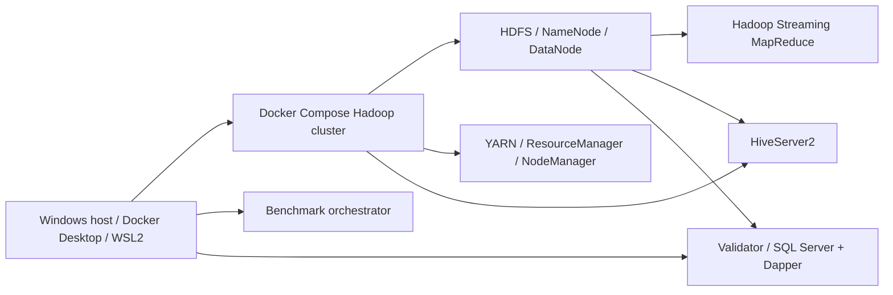

# Technical Report: Distributed Hadoop Analytics with .NET and Dapper

This report documents a practical implementation of distributed analytics on Hadoop using .NET-based MapReduce and a SQL Server validation pipeline with Dapper.

## Executive Summary

A Hadoop 2.7.4 cluster was deployed using Docker Compose. The project implements a category-count aggregation query using three independent approaches:

1. Custom MapReduce implemented in .NET via Hadoop Streaming.
2. Hive query execution on the same data.
3. Single-threaded SQL validation with SQL Server and Dapper.

The project demonstrates correctness and performance for a 5GB dataset, evaluates the effect of node count and split size, and documents constraints introduced by the Hadoop image environment.

## Architecture

The architecture consists of three main execution paths:

- **Hadoop Streaming MapReduce** — Mapper and Reducer executables read from `stdin` and write to `stdout`.
- **Hive** — HiveQL query executed through HiveServer2.
- **Validation** — SQL Server ingestion and Dapper query to verify MapReduce output.

Shared logic is placed in `src/Common`, while host-side orchestration and validation use .NET 10. MapReduce components use .NET Core 3.1 for compatibility with the Hadoop node manager image.



## Platform and Dependencies

- Docker Desktop with WSL2
- .NET 10 SDK (`global.json` pins `10.0.300`)
- Hadoop 2.7.4 Docker images
- SQL Server 2022 container
- Hive 2.3.2 container

## Compatibility Decision

The Hadoop node manager image is based on Debian 8 and glibc 2.19. This requires the MapReduce executables to remain on .NET Core 3.1 because later .NET runtimes require newer glibc versions.

### Compatibility matrix

- .NET Core 3.1: compatible with Debian 8 / glibc 2.19
- .NET 6, 7, 8, 9, 10: incompatible with Debian 8 glibc

## Design Approach

### Hadoop Streaming

Hadoop Streaming allows external executables to participate in MapReduce jobs. The contract is:

- Mapper reads lines from `stdin` and emits `key\tvalue` pairs to `stdout`.
- Reducer reads sorted key/value pairs from `stdin` and emits aggregated results.

This project uses .NET executables for both Map and Reduce steps.

### Validation with Dapper

Validation is performed by loading the dataset into SQL Server using `SqlBulkCopy`, then running a single-threaded SQL aggregation query with Dapper. The results are compared against Hadoop MapReduce output to confirm correctness.

### Container delivery

Mapper and Reducer binaries are baked into a custom NodeManager image so that Hadoop tasks can execute them without transferring files for every job. This also ensures executable permissions are preserved.

## Execution Workflow

1. Build all .NET projects and publish Linux self-contained Mapper/Reducer binaries.
2. Start the Hadoop cluster, Hive, and SQL Server containers.
3. Load dataset into HDFS.
4. Run the MapReduce job through Hadoop Streaming.
5. Run the Hive query for comparison.
6. Validate output with SQL Server / Dapper.
7. Collect benchmark results.

## Results Summary

- The MapReduce and SQL Server validation outputs matched exactly.
- The benchmark demonstrates diminishing returns from adding nodes once the execution is bound by task startup overhead and data shuffling.
- The Docker-based Hadoop environment is sufficient for reproducible experimentation, but has limitations when using modern .NET runtimes for containerized execution.

## Recommendations

- Keep MapReduce binaries on .NET Core 3.1 for the current Hadoop image.
- Use the provided benchmark scripts to evaluate scale changes before changing cluster configuration.
- For future updates, consider rebuilding the NodeManager image on a modern base if .NET 10 or later runtime support is required inside Hadoop tasks.

## Appendix

### Commands

```powershell
./scripts/00-prereqs.ps1
./scripts/01-build.ps1
./scripts/02-cluster-up.ps1 -DataNodes 2 -NodeManagers 1
./scripts/03-fetch-data.ps1
./scripts/04-ingest.ps1 -File big.csv
./scripts/05-run-mapreduce.ps1 -InputPath /data/ecommerce/big.csv -Out /out/mr_big
./scripts/06-run-hive.ps1
./scripts/07-validate.ps1 -File big.csv -MrOut /out/mr_big
./scripts/08-benchmark.ps1 -InputPath /data/bench/bench.csv
```

### Notes

- Documentation defaults to English. Persian/Farsi copies are preserved with the `-fd` suffix.
- The default repository readme is now English.
