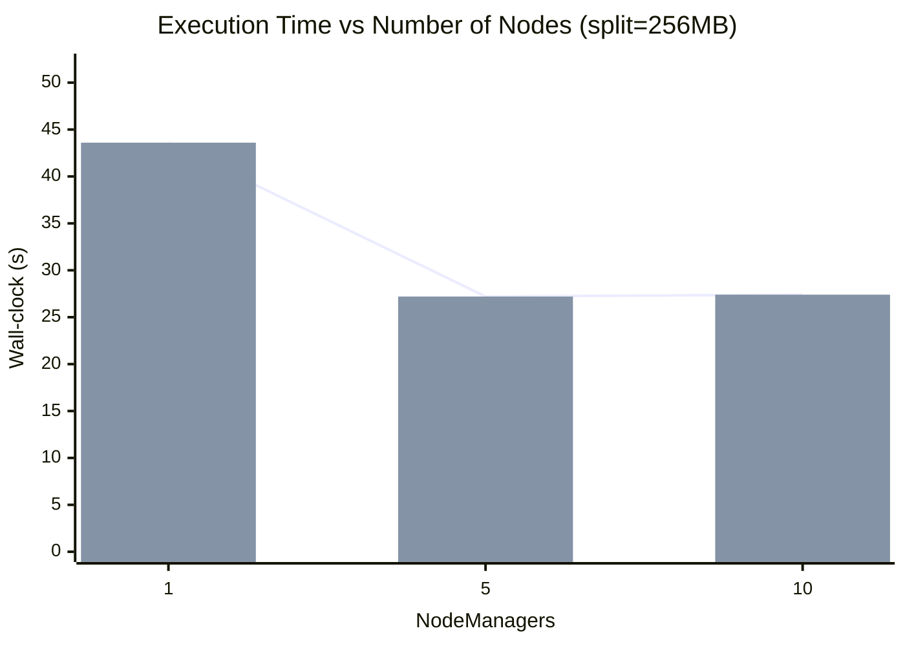
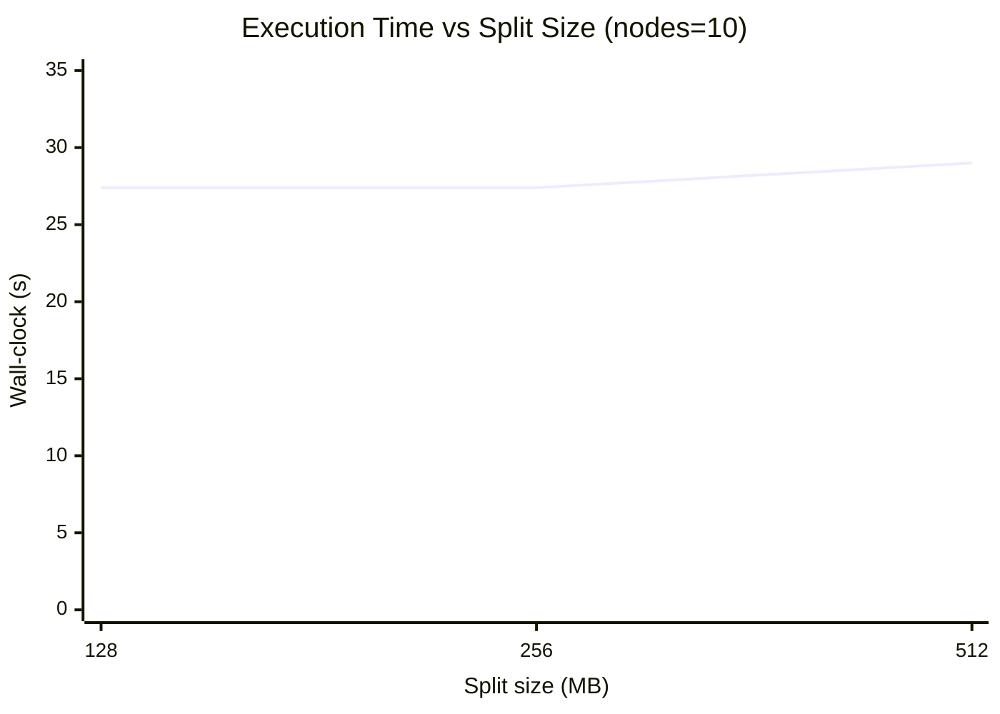

# نتایجِ بنچمارک (میانهٔ Wall-clock بر حسب ثانیه)

## جدولِ میانهٔ زمان (ثانیه)

| Nodes \ Split | 128MB | 256MB | 512MB |
|---|---:|---:|---:|
| **1** | 59.2 | 43.6 | 33.5 |
| **5** | 29.8 | 27.2 | 29.3 |
| **10** | 27.4 | 27.4 | 29.0 |

## نمودار ۱ — Execution Time vs Number of Nodes (split=256MB)

## نمودار ۲ — Execution Time vs Split Size (nodes=10)

