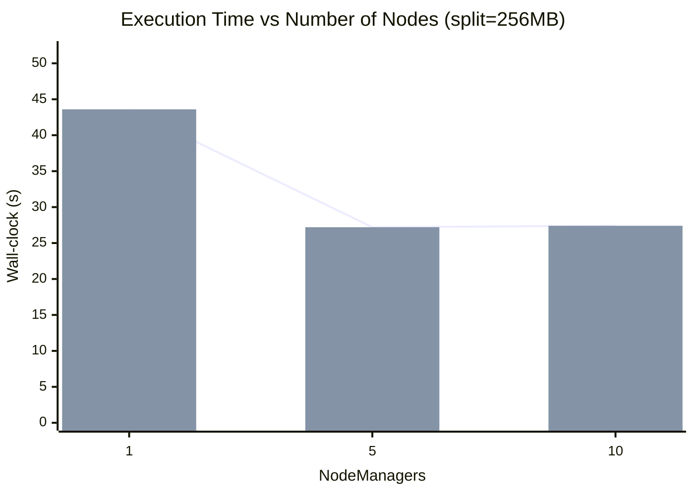
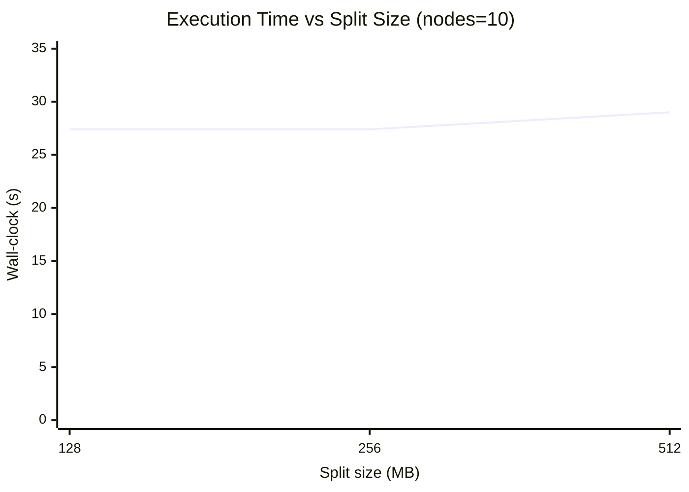

# Benchmark Results

This document shows benchmark results for Hadoop MapReduce job execution with different node counts and split sizes.

## Median Execution Time (seconds)

| NodeManagers | Split Size | Median Wall-clock |
| ------------ | ---------- | ----------------: |
| 1            | 128 MB     |              59.2 |
| 1            | 256 MB     |              43.6 |
| 1            | 512 MB     |              33.5 |
| 5            | 128 MB     |              29.8 |
| 5            | 256 MB     |              27.2 |
| 5            | 512 MB     |              29.3 |
| 10           | 128 MB     |              27.4 |
| 10           | 256 MB     |              27.4 |
| 10           | 512 MB     |              29.0 |

## Observations

- Increasing the number of NodeManagers from 1 to 5 produces a substantial reduction in execution time.
- Adding more NodeManagers beyond 5 yields limited additional improvement for this workload.
- Split size has a measurable effect, with 256 MB offering the best balance for this dataset and cluster configuration.

## Execution Time vs NodeManagers (split = 256 MB)

## Execution Time vs Split Size (nodes = 10)

## Notes

- Benchmarks were collected using the same dataset and environment for each configuration.
- Results are intended to show relative performance trends rather than exact production timings.
